# SmartLight — System Overview: Image Recognition, Algorithm & Decision Making

## Table of Contents

1. [System Purpose](#1-system-purpose)
2. [High-Level Architecture](#2-high-level-architecture)
3. [Stage-by-Stage Pipeline Explanation](#3-stage-by-stage-pipeline-explanation)
   - [Stage 1 — Camera Capture](#stage-1--camera-capture)
   - [Stage 2 — ROI Extraction](#stage-2--roi-extraction)
   - [Stage 3 — Motion Detection](#stage-3--motion-detection)
   - [Stage 4 — Similarity Comparison](#stage-4--similarity-comparison)
   - [Stage 5 — Decision Engine (3-Gate Logic)](#stage-5--decision-engine-3-gate-logic)
   - [Stage 6 — OpenAI Vision Classification](#stage-6--openai-vision-classification)
   - [Stage 7 — Activity Smoother](#stage-7--activity-smoother)
   - [Stage 8 — Dimmer Control & IES Lux Loop](#stage-8--dimmer-control--ies-lux-loop)
4. [Key Algorithms Explained](#4-key-algorithms-explained)
5. [Configuration Reference](#5-configuration-reference)
6. [System Flowchart](#6-system-flowchart)

---

## 1. System Purpose

SmartLight is an **AI-driven adaptive lighting system** that observes a person via a camera and automatically adjusts room brightness based on their current activity. It uses computer vision, structural image analysis, and GPT-4o Vision to classify what the person is doing, then drives a hardware dimmer (Arduino + RBDimmer) over serial using a **closed-loop IES lux controller** to maintain target illuminance levels.

**Supported activities and their IES-recommended illuminance targets:**

| Activity         | IES Target (lux) | Arduino Behavior Tag    |
| ---------------- | :--------------: | ----------------------- |
| Reading Book/s   |  500 – 750 lux   | `reading_book`          |
| Writing          |  500 – 750 lux   | `writing`               |
| Using Laptop     |  150 – 500 lux   | `using_laptop`          |
| Using Cellphone  |  100 – 200 lux   | `using_cellphone`       |
| Idle             |   50 – 100 lux   | `idle`                  |
| Idle (prolonged) |   0 (auto-off)   | _(auto-off after 90 s)_ |

Brightness is not a fixed value — it is continuously adjusted by a feedback controller until the photoresistor-measured lux lands inside the target band for the current activity.

---

## 2. High-Level Architecture

```
Camera → ROI Extractor → Decision Engine → [OpenAI GPT-4o Vision API]
                              ↓                        ↓
                         Frame Cache ←────────── ClassificationResult
                              ↓
                       Activity Smoother
                              ↓
                       Dimmer Manager
                         ↙         ↘
              LuxController      Photoresistor
              (dead-band step)   (Arduino ADC → lux)
                         ↓
                   Arduino (Serial) → RBDimmer → Lamp
```

The system is designed so the **camera loop is never blocked** by network latency. The OpenAI API call runs in a background daemon thread (`_AsyncAPIWorker`). All serial I/O to the Arduino runs in a separate `_SerialWorker` daemon thread. The main loop continues capturing, displaying, and reading cached results while both background operations are in flight.

---

## 3. Stage-by-Stage Pipeline Explanation

### Stage 1 — Camera Capture

**Module:** `camera/capture.py`  
**Class:** `CameraCapture`

The system supports two camera backends:

- **picamera2** — for Raspberry Pi CSI camera modules
- **cv2.VideoCapture** — for USB webcams or Windows development

On startup, the camera is opened and given a **2-second warmup period** to stabilize exposure. The capture loop targets **30 FPS** at **640×480 resolution**, but the display runs freely between captures. A frame-interval limiter (`1/FPS = 33 ms`) gates actual frame processing to avoid over-sampling.

Optionally, exposure, gain, and white balance can be **locked** (`CAMERA_LOCK_ENABLED`) to reduce frame-to-frame brightness drift, which improves the stability of camera-based lux estimation when the photoresistor is unavailable.

---

### Stage 2 — ROI Extraction

**Module:** `preprocessing/roi_extractor.py`  
**Class:** `ROIExtractor`

Instead of sending the entire frame to the AI, the system crops a tight bounding box around the detected person — this is the **Region of Interest (ROI)**.

**Algorithm:**

1. Run **MediaPipe Pose** on the incoming BGR frame (model complexity = 0, the fastest model)
2. Collect all 33 body landmarks returned by MediaPipe
3. Compute the min/max x and y coordinates of visible landmarks
4. Expand the bounding box by `ROI_PADDING = 10%` on all sides to include context
5. Clamp to frame boundaries and crop

**Fallback:** If MediaPipe is not installed or returns no landmarks, the full frame is used as the ROI.

The ROI serves two purposes:

- Reduces the payload size sent to the API (faster, cheaper)
- Focuses the AI's attention on the person rather than background clutter

---

### Stage 3 — Motion Detection

**Module:** `preprocessing/motion_detector.py`  
**Class:** `MotionDetector`

Before doing any expensive work, the system checks whether the scene has changed enough to warrant re-classification.

**Algorithm:**

1. Convert frame to grayscale
2. Apply **Gaussian blur** (21×21 kernel) to suppress noise
3. Compute absolute pixel difference (`cv2.absdiff`) between current and previous blurred frame
4. Apply **binary threshold** at `MOTION_THRESHOLD = 25` intensity units
5. **Dilate** the thresholded image (2 iterations) to connect nearby changed regions
6. Find contours and sum the area of contours larger than `MOTION_MIN_AREA = 600 px²`
7. Report `motion_detected = True` if any qualifying contour exists; `magnitude` = fraction of frame area covered

**Why this matters:** If nothing is moving, the activity hasn't changed. Skipping the API call when there's no motion saves cost and latency.

---

### Stage 4 — Similarity Comparison

**Module:** `similarity/comparator.py`  
**Class:** `SimilarityComparator`

Even when motion is detected (e.g., minor fidgeting), the activity may not have changed. The similarity comparator checks whether the current ROI is visually close enough to the frame that was last classified by the API.

**Algorithm:**

1. Resize both frames to `SIMILARITY_RESIZE = (160, 120)` for speed
2. Convert to grayscale
3. Compute **SSIM** (Structural Similarity Index) — a perceptual metric that measures luminance, contrast, and structure simultaneously
4. If scikit-image is unavailable, fall back to **histogram correlation** (`cv2.compareHist`)
5. Return `(score, is_similar)` where `is_similar = score >= SIMILARITY_THRESHOLD (0.92)`

**SSIM** ranges from 0.0 (completely different) to 1.0 (identical). The 0.92 threshold means the scene must be 92% structurally similar to the last classified frame before the system considers it unchanged.

---

### Stage 5 — Decision Engine (3-Gate Logic)

**Module:** `decision_engine/engine.py`  
**Class:** `DecisionEngine`

This is the **central gating brain** of the system. It receives the ROI every frame and decides whether to call the API or reuse the cached result. Three gates are evaluated in order:

```
Gate 1 — Motion Check
    ↓ (motion NOT detected)           → REUSE CACHE  (reason: "no_motion")
    ↓ (motion detected)
Gate 2 — Similarity Check
    ↓ (SSIM score ≥ 0.92)             → REUSE CACHE  (reason: "similar_frame")
    ↓ (scene has changed enough)
Gate 3 — API Cooldown Check
    ↓ (last API call < 3.0 s ago)     → REUSE CACHE  (reason: "cooldown")
    ↓ (cooldown elapsed)
→ CALL API                            (reason: "significant_change")
```

Only when **all three gates pass** is the OpenAI Vision API called.

---

### Stage 6 — OpenAI Vision Classification

**Module:** `ai/openai_client.py`  
**Class:** `OpenAIVisionClient`  
**Background executor:** `_AsyncAPIWorker` (in `main.py`)

When the decision engine says `CALL_API`, the ROI frame is handed to `_AsyncAPIWorker.submit()`, which launches a daemon thread. The main loop continues without waiting.

**Classification process:**

1. **Resize** the ROI to `ENCODE_WIDTH × ENCODE_HEIGHT = 640×480`
2. **JPEG encode** at quality 75 (`cv2.imencode`)
3. **Base64 encode** the JPEG bytes
4. Build an **OpenAI Chat Completions** request for model `gpt-4o` with:
   - A **system prompt** constraining output to exactly one of five allowed labels
   - A **user prompt** requesting JSON with `activity`, `confidence`, and `reasoning`
   - The base64 image as an inline `image_url`
5. Parse the JSON response into a `ClassificationResult` dataclass
6. Reject results with `confidence < CONFIDENCE_THRESHOLD (50)` and fall back to the cached result
7. On success, call `frame_cache.update()` and `similarity_comparator.update_reference()`

**Constrained system prompt:**

> "You MUST ONLY use one of these labels: Reading Book/s, Using Cellphone, Using Laptop, Writing, Idle. Respond with valid JSON only."

**API result format:**

```json
{
  "activity": "Reading Book/s",
  "confidence": 87,
  "reasoning": "Person is holding a book and looking downward."
}
```

---

### Stage 7 — Activity Smoother

**Module:** `stability/activity_smoother.py`  
**Class:** `ActivitySmoother`

Raw API results can flicker between labels on consecutive calls. The smoother applies **temporal majority voting** to produce a stable output.

**Algorithm:**

1. Maintain a **rolling deque** of the last `STABILITY_WINDOW = 12` results
2. For each update, count how many times each activity label appears in the window
3. Find the label with the highest count (`best_act`)
4. If `best_act` appears in at least `STABILITY_MAJORITY = 70%` of the window → emit it as the stable label
5. Otherwise → retain the previous stable label (no change)
6. The emitted confidence is the **average confidence** across all occurrences of the winning label in the window

At 15 effective classifications per second, a 12-item window covers approximately 0.8 seconds of history. This means the system resists momentary misclassifications but still responds to genuine activity changes within about a second.

---

### Stage 8 — Dimmer Control & IES Lux Loop

**Modules:** `dimmer_controller/dimmer_manager.py`, `dimmer_controller/lux_controller.py`, `dimmer_controller/controller.py`  
**Classes:** `DimmerManager`, `LuxController`, `DimmerController`

This stage translates the stable activity label into real-world illuminance, using a **closed-loop photoresistor feedback controller** to maintain IES-recommended lux levels.

---

#### 8a — Commit Delay (Debounce)

A new activity must persist continuously for `DIMMER_COMMIT_DELAY = 1.5 s` before any serial command is dispatched. This prevents dimmer flickering when the smoother oscillates at a decision boundary.

---

#### 8b — Photoresistor Lux Sensing

The Arduino polls the photoresistor (connected to ADC pin A2) every `PHOTORESISTOR_POLL_INTERVAL = 0.5 s` via the `PHOTOLUX?` serial command. The raw ADC value (0–1023) is converted to lux through two steps:

**1. Log-linear calibration interpolation**

The `PHOTORESISTOR_CALIBRATION_POINTS` dictionary maps measured ADC values to real lux meter readings. Conversion uses piecewise **log-linear interpolation** — interpolating linearly in log(lux) space — which fits the LDR's power-law physics ($R \propto E^{-\gamma}$) far better than plain linear interpolation, especially in the steep high-lux region (ADC 560–621) where a few ADC units span hundreds of lux:

$$\text{lux} = \exp\!\Bigl(\ln(\text{lux}_1) + t \cdot \bigl(\ln(\text{lux}_2) - \ln(\text{lux}_1)\bigr)\Bigr), \quad t = \frac{\text{ADC} - \text{ADC}_1}{\text{ADC}_2 - \text{ADC}_1}$$

**2. Exponential Moving Average (EMA) smoothing**

$$\text{lux}_\text{smooth} = \alpha \cdot \text{lux}_\text{new} + (1 - \alpha) \cdot \text{lux}_\text{prev}, \quad \alpha = 0.15$$

With $\alpha = 0.15$ the effective window is $\approx 6$ samples, suppressing ADC noise without adding meaningful lag to the 2-second control tick.

---

#### 8c — Initial Brightness Seed

On first commit for a new activity, `LuxController.set_initial()` seeds the brightness to the value that physically produces the **midpoint lux** of the IES target range, using piecewise-linear interpolation of `LUX_BRIGHTNESS_TABLE`:

|   Lux Range   | Brightness Range |
| :-----------: | :--------------: |
| 50 – 100 lux  |     10 – 20%     |
| 100 – 200 lux |     20 – 40%     |
| 150 – 300 lux |     30 – 50%     |
| 500 – 750 lux |    80 – 100%     |

This ensures the light jumps immediately to a physically meaningful level rather than stepping from wherever it was.

---

#### 8d — Dead-Band Step Controller

Every `LUX_CONTROL_INTERVAL = 2.0 s`, `LuxController.compute()` evaluates one tick:

```
calibrated_lux = raw_lux × LUX_CALIBRATION_SCALE + LUX_CALIBRATION_OFFSET

if calibrated_lux < range_min  →  brightness += LUX_STEP_SIZE (2%)   # too dark
if calibrated_lux > range_max  →  brightness -= LUX_STEP_SIZE (2%)   # too bright
else                            →  hold (no serial command sent)
```

Brightness is hard-clamped to [1%, 100%]. Changed brightness values are enqueued to the `_SerialWorker` background thread and sent to the Arduino as `behavior:brightness` (e.g., `reading_book:88`).

---

#### 8e — Display Brightness Percentage

The "Light: X%" value shown in the camera feed overlay is derived from the **current photoresistor lux reading** mapped through `LUX_BRIGHTNESS_TABLE` — it represents what percentage the current illuminance corresponds to, not the last command sent to the Arduino.

---

#### 8f — Idle Auto-Off

If the stable activity remains `"Idle"` continuously for `IDLE_AUTO_OFF_SECONDS = 90 s`, the system sends `off:0` to the Arduino, cutting the light completely. The light automatically resumes as soon as any non-idle activity is detected.

---

#### 8g — Keepalive & Graceful Fallback

A PING is sent every **30 seconds** to prevent the Arduino firmware's 60-second safety timeout from triggering a reset during stable activity periods.

If the Arduino is not connected, a warning is logged and the system continues operating (camera, AI, display) without dimmer control.

---

## 4. Key Algorithms Explained

### Structural Similarity Index (SSIM)

$$\text{SSIM}(x, y) = \frac{(2\mu_x\mu_y + C_1)(2\sigma_{xy} + C_2)}{(\mu_x^2 + \mu_y^2 + C_1)(\sigma_x^2 + \sigma_y^2 + C_2)}$$

Where $\mu$ is the mean luminance, $\sigma^2$ is the variance, and $\sigma_{xy}$ is the covariance. $C_1, C_2$ are small constants for numerical stability. SSIM is more perceptually meaningful than MSE because it accounts for structural patterns, not just pixel-level differences.

### Motion Magnitude

$$\text{magnitude} = \frac{\sum_{c \in \text{contours},\, \text{area}(c) > A_{\min}} \text{area}(c)}{W \times H}$$

This is the fraction of the frame covered by significant motion regions, giving a normalized 0.0–1.0 score.

### Temporal Majority Voting

$$\text{stable\_label} = \arg\max_{a} \frac{|\{w \in W : w = a\}|}{|W|}, \quad \text{if } \max > \text{majority\_threshold}$$

Otherwise the previous stable label is retained.

### Log-Linear LDR Calibration

$$\text{lux} = \exp\!\Bigl(\ln(\text{lux}_1) + \frac{\text{ADC} - \text{ADC}_1}{\text{ADC}_2 - \text{ADC}_1} \cdot \bigl(\ln(\text{lux}_2) - \ln(\text{lux}_1)\bigr)\Bigr)$$

This fits the LDR's power-law illuminance–resistance relationship, significantly improving accuracy in the steep high-lux region compared to linear interpolation.

---

## 5. Configuration Reference

### Camera

| Parameter                 | Value     | Purpose                                  |
| ------------------------- | --------- | ---------------------------------------- |
| `FPS`                     | 30        | Camera capture frame rate                |
| `FRAME_WIDTH / HEIGHT`    | 640 × 480 | Capture resolution                       |
| `CAMERA_LOCK_ENABLED`     | False     | Lock exposure/gain for stable lux trends |
| `CAMERA_LOCK_EXPOSURE_US` | 33000 µs  | Fixed shutter time when lock enabled     |
| `CAMERA_LOCK_ANALOG_GAIN` | 3.0       | Fixed sensor gain when lock enabled      |

### Preprocessing & Decision

| Parameter              | Value      | Purpose                                  |
| ---------------------- | ---------- | ---------------------------------------- |
| `MOTION_THRESHOLD`     | 25         | Pixel intensity diff to count as changed |
| `MOTION_MIN_AREA`      | 600 px²    | Min contour area for motion              |
| `ROI_PADDING`          | 0.10 (10%) | Body bbox expansion factor               |
| `SIMILARITY_THRESHOLD` | 0.92       | SSIM score to skip API call              |
| `SIMILARITY_RESIZE`    | 160 × 120  | Resolution for SSIM computation          |
| `API_COOLDOWN_SECONDS` | 3.0 s      | Min time between API calls               |
| `CONFIDENCE_THRESHOLD` | 50         | Min AI confidence to accept result       |

### Image Encoding

| Parameter               | Value     | Purpose                         |
| ----------------------- | --------- | ------------------------------- |
| `ENCODE_WIDTH / HEIGHT` | 640 × 480 | Resolution of image sent to API |
| `JPEG_QUALITY`          | 75        | JPEG quality for API payload    |

### Activity Stability

| Parameter            | Value | Purpose                          |
| -------------------- | ----- | -------------------------------- |
| `STABILITY_WINDOW`   | 12    | Rolling window size for smoother |
| `STABILITY_MAJORITY` | 0.70  | Fraction needed for stable label |

### Dimmer & Lux Control

| Parameter                | Value             | Purpose                                 |
| ------------------------ | ----------------- | --------------------------------------- |
| `DIMMER_ENABLED`         | True              | Enable/disable Arduino serial control   |
| `DIMMER_PORT`            | `/dev/ttyACM0`    | Arduino serial port                     |
| `DIMMER_BAUD`            | 9600              | Serial baud rate                        |
| `DIMMER_COMMIT_DELAY`    | 1.5 s             | Debounce before dimmer command          |
| `ACTIVITY_LUX_RANGE`     | per-activity dict | IES target lux bands                    |
| `LUX_STEP_SIZE`          | 2%                | Brightness increment per control tick   |
| `LUX_CONTROL_INTERVAL`   | 2.0 s             | Time between controller ticks           |
| `LUX_BRIGHTNESS_TABLE`   | list of tuples    | Lux→brightness seed anchors             |
| `LUX_CALIBRATION_SCALE`  | 1.0               | Multiplier on raw lux estimate          |
| `LUX_CALIBRATION_OFFSET` | 0.0               | Fixed lux bias after scaling            |
| `IDLE_AUTO_OFF_ENABLED`  | True              | Enable auto light-off on prolonged idle |
| `IDLE_AUTO_OFF_SECONDS`  | 90.0 s            | Idle duration before light-off          |

### Photoresistor

| Parameter                          | Value | Purpose                                |
| ---------------------------------- | ----- | -------------------------------------- |
| `PHOTORESISTOR_ENABLED`            | True  | Use hardware LDR instead of camera lux |
| `PHOTORESISTOR_POLL_INTERVAL`      | 0.5 s | Seconds between ADC polls              |
| `PHOTORESISTOR_SMOOTHING_ALPHA`    | 0.15  | EMA factor (lower = smoother)          |
| `PHOTORESISTOR_CALIBRATION_POINTS` | dict  | ADC → lux measured pairs               |

---

## 6. System Flowchart

```mermaid
flowchart TD
    A([System Start]) --> B[Initialize Components\nCamera · ROI · MotionDetector\nSimilarityComparator · FrameCache\nActivitySmoother · DimmerManager]
    B --> C{Arduino\nConnected?}
    C -- Yes --> D[Connect Serial\nPort & Worker Thread]
    C -- No --> E[Log Warning\nRun Without Dimmer]
    D --> F
    E --> F

    F([Main Loop Start]) --> G[Capture Frame\nCameraCapture.read\n640×480 @ 30 FPS]
    G --> H[Extract ROI\nROIExtractor.extract\nMediaPipe Pose → bbox + crop]
    H --> I{Pose Detected?}
    I -- Yes --> J[Crop Body Region\n+ 10% Padding]
    I -- No --> K[Use Full Frame as ROI]
    J --> L
    K --> L

    L[Motion Detection\nMotionDetector.update\nGaussian Blur → AbsDiff\n→ Threshold → Contours]
    L --> M{Motion\nDetected?}

    M -- No Motion --> N[REUSE CACHE\nreason: no_motion]
    M -- Motion Detected --> O[Similarity Check\nSimilarityComparator.compare\nSSIM at 160×120]

    O --> P{SSIM Score\n≥ 0.92?}
    P -- Similar Frame --> Q[REUSE CACHE\nreason: similar_frame]
    P -- Scene Changed --> R[API Cooldown Check\nFrameCache.should_call_api]

    R --> S{Cooldown\nElapsed?\n≥ 3.0 s}
    S -- Still Cooling --> T[REUSE CACHE\nreason: cooldown]
    S -- Cooldown Done --> U

    U[CALL API\nSubmit ROI to\n_AsyncAPIWorker thread]
    U --> V[Background Thread\nResize to 640×480\nJPEG encode @ quality 75\nBase64 encode\nSend to GPT-4o Vision]

    V --> W[Parse JSON Response\nactivity · confidence · reasoning]
    W --> X{Confidence\n≥ 50?}
    X -- Low Confidence --> Y[Reject Result\nKeep Previous Cache]
    X -- Acceptable --> Z[Update FrameCache\nUpdate Similarity Reference]

    N --> AA
    Q --> AA
    T --> AA
    Y --> AA
    Z --> AA

    AA[Read Current Cache\nCacheEntry: activity · confidence]
    AA --> AB[Activity Smoother\nActivitySmoother.update\nRolling window of 12 results]
    AB --> AC{70% Majority\nin Window?}
    AC -- No Majority --> AD[Retain Previous\nStable Label]
    AC -- Majority Reached --> AE[Emit New\nStable Label\n+ Average Confidence]
    AD --> AF
    AE --> AF

    AF[Poll Photoresistor\nSend PHOTOLUX? via Serial\nADC → log-linear cal → EMA]
    AF --> AG[DimmerManager.update\nstable_activity + current_lux]
    AG --> AH{Activity = Idle\n≥ 90s?}
    AH -- Yes --> AI[Auto-Off\nSend off:0]
    AH -- No --> AJ{Activity\nChanged?}
    AJ -- Same --> AK[LuxController.compute\nevery 2.0s tick]
    AJ -- New Activity --> AL{Commit Delay\n1.5s elapsed?}
    AL -- Not Yet --> AM[Debounce / Wait]
    AL -- Committed --> AN[set_initial\nSeed brightness from\nLUX_BRIGHTNESS_TABLE midpoint]
    AN --> AO[Send behavior:brightness\nto _SerialWorker queue]
    AK --> AP{lux vs IES range?}
    AP -- Too Dark --> AQ[brightness += 2%\nSend command]
    AP -- Too Bright --> AR[brightness -= 2%\nSend command]
    AP -- In Band --> AS[Hold / No command]
    AO --> AT
    AQ --> AT
    AR --> AT
    AS --> AT
    AI --> AT
    AM --> AT

    AT[Arduino Firmware\nRBDimmer adjusts\nAC power phase angle]

    AT --> AU[Draw Overlay\nActivity · Confidence · Source\nFPS · Lux · Light%\n_lux_to_brightness from current lux]
    AU --> AV{Headless\nMode?}
    AV -- No --> AW[cv2.imshow\nDisplay Frame]
    AV -- Yes --> AX[Skip Display]
    AW --> AY
    AX --> AY

    AY{Q Pressed\nor Ctrl+C?}
    AY -- Continue --> F
    AY -- Exit --> AZ[Release Camera\nStop Dimmer Worker\nClose Windows]
    AZ --> BA([System Stop])

    style A fill:#1a1a2e,color:#eee,stroke:#444
    style BA fill:#1a1a2e,color:#eee,stroke:#444
    style F fill:#16213e,color:#eee,stroke:#4a90d9,stroke-width:2px
    style U fill:#0f3460,color:#fff,stroke:#4a90d9,stroke-width:2px
    style V fill:#0f3460,color:#fff,stroke:#4a90d9
    style N fill:#2d4a1e,color:#cfc,stroke:#4a8
    style Q fill:#2d4a1e,color:#cfc,stroke:#4a8
    style T fill:#2d4a1e,color:#cfc,stroke:#4a8
    style Z fill:#1e3a4a,color:#adf,stroke:#48a
    style AT fill:#4a2d00,color:#ffd,stroke:#a84
    style AZ fill:#3a1a1a,color:#fcc,stroke:#a44
    style AI fill:#3a1a1a,color:#fcc,stroke:#a44
```



---

### Flowchart Legend

| Color             | Meaning                                            |
| ----------------- | -------------------------------------------------- |
| Dark Blue nodes   | System lifecycle events (start / main loop / stop) |
| Medium Blue nodes | OpenAI API call path                               |
| Green nodes       | Cache reuse decisions (no API call)                |
| Steel Blue nodes  | Cache update after successful API call             |
| Orange/Brown node | Arduino hardware command                           |
| Dark Red nodes    | Auto-off / System shutdown                         |
